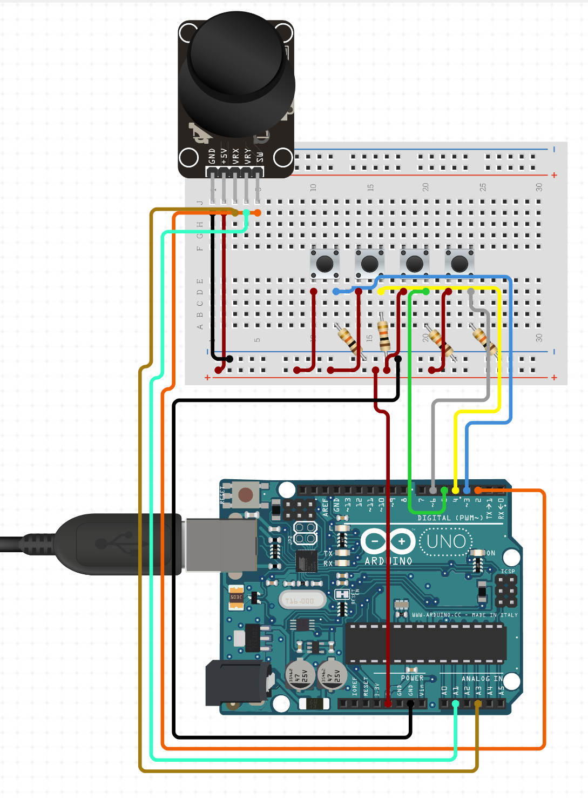
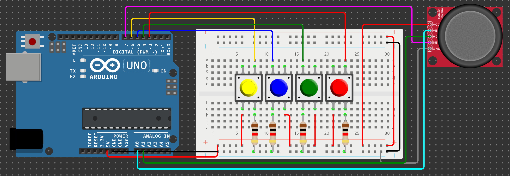
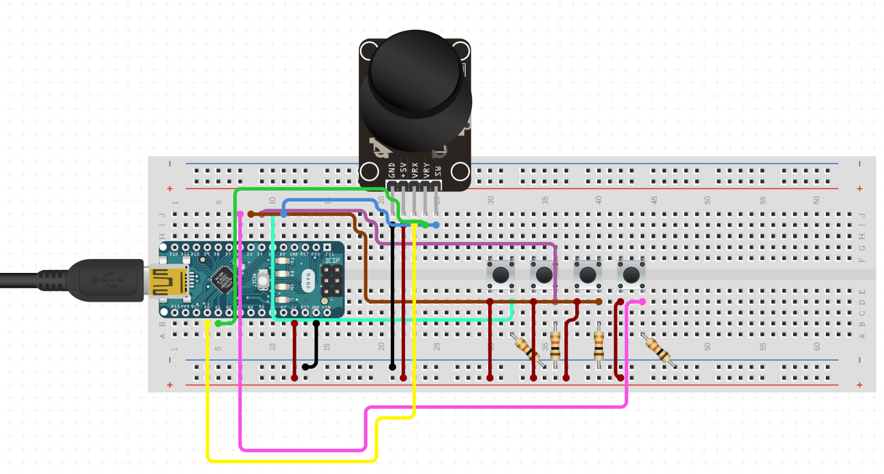
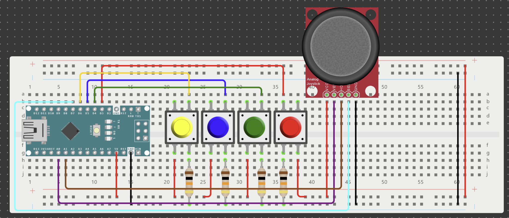
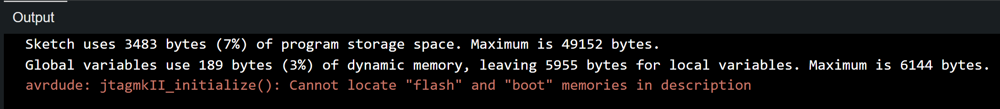
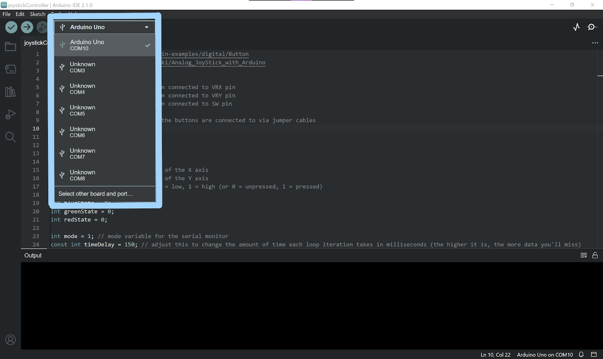
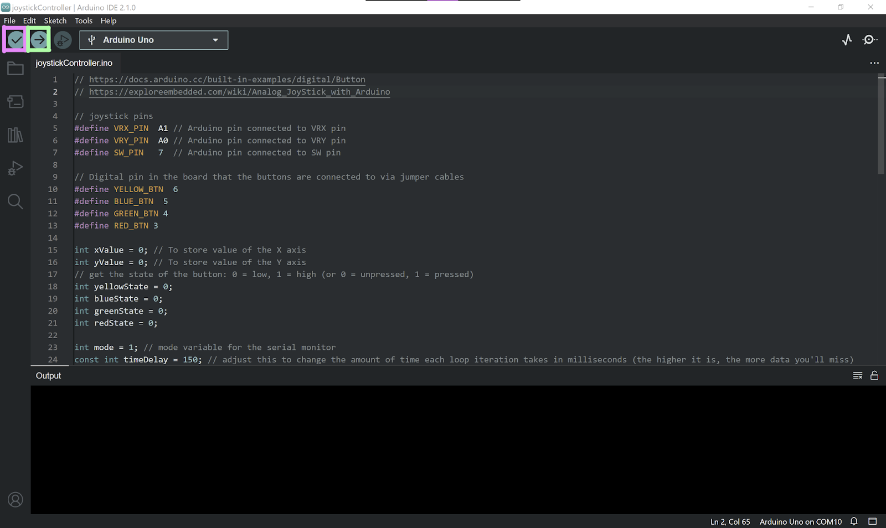
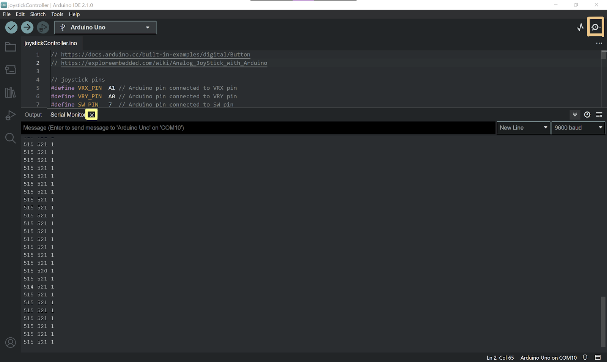
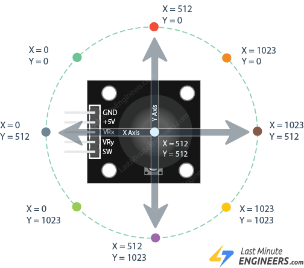
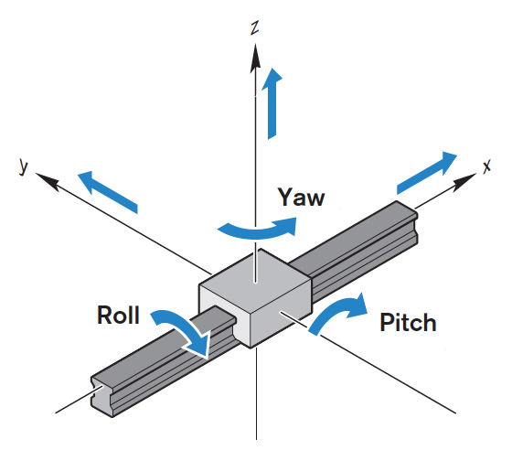

# Misty’s Physical Controller

#### *Created by Julia Yu*

## Wiring the Circuit

### [Arduino Uno Version](https://www.circuito.io/app?components=97,97,97,97,512,11021,611984)





<div style="page-break-after: always"></div>

### [Arduino Nano / Nano Every Version](https://www.circuito.io/app?components=97,97,97,97,514,11022,611984)

##### Note: the board in the picture is a Nano, but Nano Every has the same pin ordering, size, and better specs





<div style="page-break-after: always"></div>

# Uploading the Arduino code to the board
* Starting off, let's assume you’re using the IDE that is downloadable [here](https://www.arduino.cc/en/software). It’s a similar process with the Web Editor and the older Arduino uploader if you decide to go with those routes, so you can follow along regardless.

* First, have the board plugged into your computer through USB.

* Open the IDE and check that the board selected in the upper left is the board you’re using (it should automatically detect the COM port that it’s using, you’ll need that for a line in the Python controller file). *Refer to figure 1 for help.*
  * For troubleshooting, please refer to the [Arduino Support Page](https://support.arduino.cc/hc/en-us/articles/4412955149586-If-your-board-does-not-appear-on-a-port-in-Arduino-IDE).

* Click the checkmark to verify the sketch (or in other words, check there are no issues with the code), and then click the arrow that points to the right which is next to the checkmark. This uploads the code to the board, don’t disconnect it. *Refer to figure 2 for help.*

* After the program is uploaded, check that everything works by opening the serial monitor in the upper right corner where there is a magnifying glass. If it prints out a series of 3 numbers that change when you move the joystick and press the buttons, that means everything is wired correctly and it’s ready to go. *Refer to figure 3 for help.*

* Close the serial monitor (you can do this by either closing the IDE or clicking the little “x” that appears on the serial monitor tab at the bottom of the screen (you must do this before you run the python file since only 1 application can access the serial monitor at a time). *Refer to figure 3 for help.*

* Please note, if the following text appears when you are uploading the sketch to an Arduino Nano Every, refer to [this link](https://support.arduino.cc/hc/en-us/articles/4405239282578-avrdude-jtagmkII-initialize-Cannot-locate-flash-and-boot-memories-in-description) for more information about what that means.




<p style="text-align: center;"> <em> Figure 1: Getting the computer to recognize the board </em> </p>



<p style="text-align: center;"> <em> Figure 2: Verifying and Uploading the Sketch (the pink and green boxes respectively) </em> </p>



<p style="text-align: center;"> <em> Figure 3: Opening and Closing the Serial Monitor (the orange and yellow boxes respectively) </em> </p>

<div style="page-break-after: always"></div>

# Run the Python File
* Install the following python packages through pip. The second line should install the packages following it, but in case it doesn’t, the others are also listed. Check back in the Misty Walkthrough for more details on what versions specifically to install if this is the case.
  * `pip install pyserial`
  * `pip install Misty-SDK`
  * `pip install requests`
  * `pip install websocket-client`
  * `pip install yapf`

* Please note: Misty II uses Python 3.9, so if you also end up coding other programs for Misty to run in Python, keep this in mind.

* When trying to run the controller file, you will need to change the IP address (line 5) to match it in the program to the one that your Misty uses. You also need to change the COM address (line 82) to match it to the one that the Arduino uses.

* Run the file in Terminal / Command Prompt using `python <name-of-file.py>` while in the same directory and with the Arduino still plugged into your computer.

* If everything was done correctly, you have a functioning (albeit a bit laggy) controller!

<div style="page-break-after: always"></div>

# Arduino Line-by-Line Code Walkthrough

#### Find the Arduino Documentation [Here](https://www.arduino.cc/reference/en/)

*Declarations and Variables*

``` cpp
#define VRX_PIN  A1
#define VRY_PIN  A0
#define SW_PIN   7
#define YELLOW_BTN  6
#define BLUE_BTN  5
#define GREEN_BTN 4
#define RED_BTN 3
```

The [#define statements](https://www.arduino.cc/reference/en/language/structure/further-syntax/define/) are somewhat like constants. These will assign a value to the given name of a variable, though these have their own drawbacks. These can be changed to be constants via something akin to `const int X = ...`.

Overall, these are used to tell the program what pins the buttons and joystick are hooked up to, and can be changed depending on the wiring of the actual circuit.

```cpp
int xValue = 0;
int yValue = 0;
int yellowState = 0;
int blueState = 0;
int greenState = 0;
int redState = 0;

int mode = 1;
const int timeDelay = 150;
```

These are global variables that are meant to keep track of certain values that would be important for us in this program. `xValue` and `yValue` are used for the joystick, while the different colored `__States` are used for the buttons. `Mode` is used for tracking which commands to send to Misty, and `timeDelay` is a constant that is user changeable in order to create a buffer between each line outputted in the Serial Monitor.

<div style="page-break-after: always"></div>

*Setting Up*

```cpp
void setup() {
    Serial.begin(9600);
    while (!Serial);
    pinMode(YELLOW_BTN, INPUT);
    pinMode(BLUE_BTN, INPUT);
    pinMode(GREEN_BTN, INPUT);
    pinMode(RED_BTN, INPUT);
}
```

The first thing that comes after constant declaration is the [setup loop](https://www.arduino.cc/reference/en/language/structure/sketch/setup/). It runs only once before the program moves on. First, it starts communication with the Serial Monitor using `Serial.begin()` and waits until that is complete through the for loop. Then it sets the `pinMode` for the buttons to be inputs, which is required in order for the program to know what the values coming in from those pins are.

*Forever Loop*

```cpp
void loop() {
    xValue = analogRead(VRX_PIN);
    yValue = analogRead(VRY_PIN);

    yellowState = digitalRead(YELLOW_BTN);
    blueState = digitalRead(BLUE_BTN);
    greenState = digitalRead(GREEN_BTN);
    redState = digitalRead(RED_BTN);

    if (yellowState == HIGH){
        mode = 1;
    }
    if (blueState == HIGH){
        mode = 2;
    }
    if (greenState == HIGH){
        mode = 3;
    }
    if (redState == HIGH){
        mode = 4;
    }

    Serial.print(xValue);
    Serial.print(" ");
    Serial.print(yValue);
    Serial.print(" ");
    Serial.println(mode);
    delay(timeDelay);
}
```

The loop runs the code in it over and over forever, and is where all the action happens. First it gets the values for the joystick’s positioning and assigns them to `xValue` and `yValue` through [`analogRead()`](https://www.arduino.cc/reference/en/language/functions/analog-io/analogread/). The program then does the same with the buttons, but instead uses [`digitalRead()`](https://www.arduino.cc/reference/en/language/functions/digital-io/digitalread/) which can only return either `HIGH` or `LOW` (2 values in opposition to `analogRead` being able to return numbers ranging from 0 to 1023).

The following if statements are to determine whether or not a button was pressed, and if one was, change the mode to the corresponding number. This mode is used in the Python program reviewed below.

`Serial.print()` and `Serial.println()` are the Serial Monitor print statements of Arduino. The purpose of having these here is to interface with the pySerial library in the Python program. It takes information from the Serial Monitor and allows us to use it for other purposes.

<div style="page-break-after: always"></div>

# Python Line-by-Line Code Walkthrough

*Python Imports and Misty Declaration*

```python
import serial
import time
from mistyPy.Robot import Robot
```

These are the libraries that the code needs. See the above section on how to install them.

```python
misty = Robot("<insert Misty IP>")
```

This line creates an instance of Misty using `mistyPy.Robot`, and needs to have the IP address as input. Refer to the overall documentation for help with getting Misty’s IP address.

*Treads Control*

```python
def treads(coords):
    split = coords.split()
    x = int(split[0])
    y = int(split[1])
    if y < 341 and x > 341 and x < 682:
        misty.Drive(linearVelocity = 10, angularVelocity = 0)
    elif y > 682 and x > 341 and x < 682:
        misty.Drive(linearVelocity = -10, angularVelocity = 0)
    elif x < 341 and y > 341 and y < 682:
        misty.Drive(linearVelocity = 0, angularVelocity = 10)
    elif x > 682 and y > 341 and y < 682:
        misty.Drive(linearVelocity = 0, angularVelocity = -10)
    elif x < 341 and y < 341:
        misty.Drive(linearVelocity = 10, angularVelocity = 10)
    elif x > 682 and y < 341:
        misty.Drive(linearVelocity = 10, angularVelocity = -10)
    elif x < 341 and y > 682:
        misty.Drive(linearVelocity = -10, angularVelocity = 10)
    elif x > 682 and y > 682:
        misty.Drive(linearVelocity = -10, angularVelocity = -10)
    else:
        misty.Halt()
```

This function is used when the button corresponding to `mode = 1` was pressed. It is also the initial movement option selected when first connecting and starting the controller up. The function has a single parameter which should be a string that was obtained from data in the Serial Monitor.

The first thing the function does is split the given string into an array of strings through `split()`, which defaults to separation via spaces. It then takes the first and second things in the array and changes them to be integers through `int()`. The reason it takes the first and second entries in the array is because of how the Arduino code is structured to print to the Serial Monitor. It first would print the X value, then the Y value, and finally the mode.

The following if-else chain is to correspond with the various situations that the joystick can be in at any given moment. The picture shown below is a good diagram that shows the coordinate system that the joystick uses.

[](https://lastminuteengineers.com/joystick-interfacing-arduino-processing/)

[`Misty.Drive()`](https://docs.mistyrobotics.com/misty-ii/web-api/api-reference/#drive) is evaluated using 2 parameters: `linearVelocity` and `angularVelocity`. Both handle the speed at which the treads go, from 0 to a maximum of 100. Linear handles speed straight ahead, while angular handles how much it turns (which is done by having one tread either be at a slower speed or not move at all). Holding up will drive Misty forward, while holding down will back her up. Left and right serve to turn Misty to the corresponding direction, and holding the joystick in any of the 4 remaining directions will evaluate to a combination of turning and moving forwards or backwards.

[`Misty.Halt()`](https://docs.mistyrobotics.com/misty-ii/web-api/api-reference/#halt) stops all of Misty's motors, which is what happens when the joystick is at resting position (otherwise known as the center).

<div style="page-break-after: always"></div>

*Arm(s) Control*

```python
def arms(data):
    split = data.split()
    x = int(split[0])
    y = int(split[1])
    if y < 341 and x > 341 and x < 682:
        misty.MoveArm(arm = "left", position = -29, velocity = 20, units = "degrees")
    elif y > 682 and x > 341 and x < 682:
        misty.MoveArm(arm = "left", position = 90, velocity = 20, units = "degrees")
    elif x < 341 and y > 341 and y < 682:
        misty.MoveArm(arm = "right", position = 90, velocity = 20, units = "degrees")
    elif x > 682 and y > 341 and y < 682:
        misty.MoveArm(arm = "right", position = -29, velocity = 20, units = "degrees")
    elif (x < 341 and y < 341) or (x > 682 and y < 341):
        misty.MoveArm(arm = "both", position = -29, velocity = 20, units = "degrees")
    elif (x < 341 and y > 682) or (x > 682 and y > 682):
        misty.MoveArm(arm = "both", position = 90, velocity = 20, units = "degrees")
    else:
        misty.Halt()
```

This function is very similar structure-wise to the above function for the treads as it uses all of the same controls on the joystick to do different things.

The first thing that is different is that it's only activated when a different button is pushed, being the one that corresponds to set `mode = 2`. It combines when the joystick is held at the upper left or right positions, as well as the lower left and right positions, in order to account for if the user would like to raise or lower both arms at once. Left and right will lower and raise the right arm respectively, while up and down will raise and lower the left arm. This function also has `misty.Halt()` in order to stop the arm movement when the user is no longer holding the joystick in a direction that is not it's resting position.

The way [`misty.MoveArm()`](https://docs.mistyrobotics.com/misty-ii/web-api/api-reference/#movearm) works is by having 2 parameters and 2 optional parameters. The 2 required are the arm that you would like to move, and the position that you would like the arm to move to. The other 2 parameters are the velocity at which the arm will move to the given position, and the units to use when moving Misty's arm(s).

<div style="page-break-after: always"></div>

*Head Control*

```python
def head(data):
    split = data.split()
    x = int(split[0])
    y = int(split[1])
    if y < 341 and x > 341 and x < 682:
        misty.MoveHead(pitch = -40, velocity = 70, units = "degrees")
    elif y > 682 and x > 341 and x < 682:
        misty.MoveHead(pitch = 26, velocity = 70, units = "degrees")
    elif x < 341 and y > 341 and y < 682:
        misty.MoveHead(yaw = 81, velocity = 70, units = "degrees")
    elif x > 682 and y > 341 and y < 682:
        misty.MoveHead(yaw = -81, velocity = 70, units = "degrees")
    elif x < 341 and y < 341:
        misty.MoveHead(roll = -40, velocity = 70, units = "degrees")
    elif x > 682 and y < 341:
        misty.MoveHead(roll = 40, velocity = 70, units = "degrees")
    else:
        misty.Halt()
```

Like the other 2 functions above, this one is also very similar. There is however, 2 missing conditionals as they aren't needed in this case.

Misty's head is able to move in 3 dimensions (x, y, z) or (roll, pitch, yaw). See the handy diagram below to have gain a better understanding about what each mean.

<a href="https://www.linearmotiontips.com/motion-basics-how-to-define-roll-pitch-and-yaw-for-linear-systems/">
    
</a> 

If you still don't really understand, think of it this way: pitch will cause Misty to nod, roll will cause Misty to shake her head no, and yaw will cause Misty to look like a cat tilting their head to the side.

So, according to the code, pushing up or down on the joystick will cause Misty to move her head up and down, left and right will cause Misty to turn her head left and right, and holding the joystick to either the top left or top right will cause Misty to tilt her head.

The way that [`misty.MoveHead()`](https://docs.mistyrobotics.com/misty-ii/web-api/api-reference/#movehead) works is by having 3 required parameters, one for roll, pitch, and yaw. These will default to 0 if not specified. This method also uses velocity, which defaults to 10, duration of how long to move the head for (though the documentation specifies to only pass in a value for either velocity or duration and not both), and the units that the roll, pitch or yaw would be specified in.

*Mode Selection*

```python
def mode(data):
    split = data.split()
    command = int(split[2])
    if command == 1:
        treads(data)
    elif command == 2:
        arms(data)
    elif command == 3:
        head(data)
    elif command == 4:
        print("stop misty communication")
```

Like all the other functions created above, this one also uses data from the Serial Monitor. However, `mode()` is not reliant on where the joystick is positioned. It relies on whichever button has been recently pressed in order to change what the joystick will act as. Remembering the Arduino code, the way that data is printed to the Serial Monitor is by first having the x and y coordinates of the joystick, and then the integer corresponding to the mode, changeable only through button presses.

All in all, the process is the same, but only with 1 number and it won't fluctuate if you try and move it.

*Bringing it All Together*

```python
if __name__ == "__main__":
    ser = serial.Serial("<insert Arduino COM>", 9600, timeout = 1)
    time.sleep(1)
    while True:
        line = ser.readline()
        if line:
            string = line.decode()
            if " " in string:
                strip = string.strip()
                mode(strip)
                if int(strip.split()[2]) == 4:
                    break
    ser.close()
```

Using [`serial.Serial()`](https://pythonhosted.org/pyserial/pyserial_api.html) we are able to open communications between the COM port on a computer and this Python script.

[`Ser.readline()`](https://pyserial.readthedocs.io/en/latest/pyserial_api.html) lets us get a single line of data from the Serial Monitor in a byte object. If this results in anything, it goes ahead and decodes it from being in bytes to being a string in Python we can manipulate. We then check to make sure that there is a space in the string, as it would not be a valid piece of data otherwise. If there is, the string will be stripped of the newline character that comes at the end of it, and the result will be passed into `mode()`.

After `mode()` evaluates, if the mode is equal to 4, that means that the user pressed the button corresponding to 4 and the code will break out of the infinite `while`  that was made and then will close the communication between the Serial Monitor and the Python script and terminate the program.
